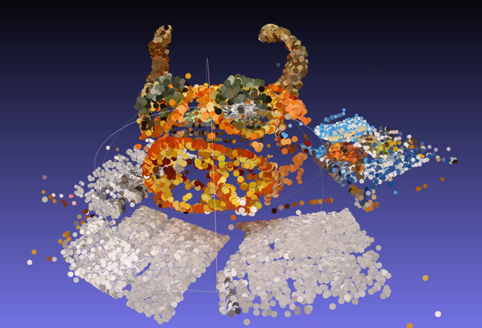
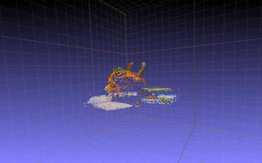
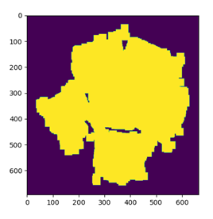
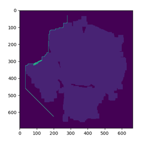
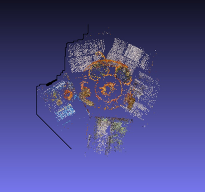

#### 环境配置

> opencv-python-contrib 3.4.2.16
> numpy 1.15.2
> scipy 1.2.1
> matplotlib 3.0.3

#### 运行方法

> 配置config.py 中的图片路径后运行sfmAndPathPlan.py即可。

#### 程序说明

> 1. sfm.py里存储着三维重建需要用到的函数
> 2. pathlan.py里A*存储路径规划需要用到的函数
> 3. sfmAndPathPlan.py中最后几行将SFM（）注释了，因为SFM耗时比较长，且结果已保存，若想查看可视化结果只用运行其中的函数PathPlan（）即可。

#### 结果展示

<table border="0">
  <tr>    
    <td width="50%">
      
    </td>
    <td width="50%">
      
    </td>
  </tr>
</table>

